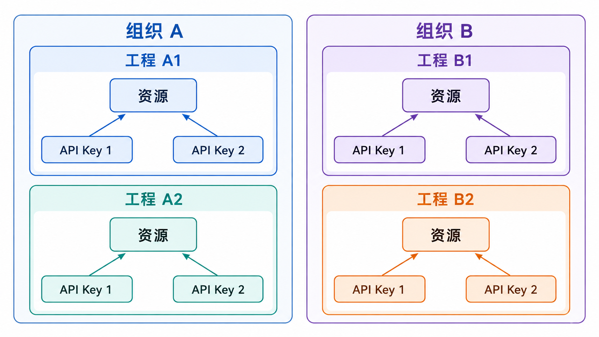

# 安装 langfuse

官网：https://langfuse.com/

## 准备工作

1. 停用所有`postgresql`、`redis`服务，避免端口号冲突

2. 使用`git clone`克隆`langfuse`项目到本地

   ```shell
   # 最近版本
   git clone https://github.com/langfuse/langfuse.git
   # 指定版本
   git clone --branch v4.30.0 --single-branch --depth 1 https://github.com/langfuse/langfuse.git
   ```

3. 进入目录，新建环境变量文件`.env`，配置如下：

   ```yaml
   # [可选]对导出启用S3对象存储
   LANGFUSE_S3_BATCH_EXPORT_ENABLED=true
   
   # [可选]配置事务邮件发送
   # Langfuse 对外访问地址，用于生成邀请和密码重置链接
   NEXTAUTH_URL=""
   # 发件人地址，必须是邮件服务商允许发送的地址
   EMAIL_FROM_ADDRESS=""
   # SMTP SSL，通常使用 465 端口
   SMTP_CONNECTION_URL=""
   
   # [可选]设置AI提供商
   LANGFUSE_AI_PROVIDER=openai
   LANGFUSE_AI_MODEL=qwen3.7-plus
   LANGFUSE_AI_API_KEY=
   LANGFUSE_AI_BASE_URL=
   ```

## 容器管理

`langfuse`已为你写好了容器编排脚本：`docker-compose.yml`

以下命令需要在`langfuse`项目根目录中执行。

```shell
# 创建并在后台启动所有容器
docker compose up -d

# 查看容器状态
docker compose ps

# 持续查看所有容器的日志，按 Ctrl+C 退出
docker compose logs -f

# 停止容器，但保留容器
docker compose stop

# 启动已经停止的容器
docker compose start

# 重启所有容器
docker compose restart

# 停止并删除容器和网络，不会删除数据卷
docker compose down

# 重新创建并在后台启动所有容器
docker compose up -d --force-recreate
```

## 访问服务

容器启动成功后，可以从宿主机访问以下服务。

### Langfuse 管理控制面

使用浏览器访问：

```text
http://localhost:3000
```

首次访问时，需要按照页面提示注册管理员账号并创建项目。

### Langfuse API

Langfuse API 与管理控制台共用`3000`端口，API 基础地址为：

```text
http://localhost:3000
```

API 文档地址：

```text
http://localhost:3000/api/docs
```

### MinIO 对象存储

Langfuse 使用 MinIO 保存上传文件和批量导出文件。

| 服务 | 访问地址 | 用途 |
| --- | --- | --- |
| MinIO API | `http://localhost:9090` | Langfuse 读写对象存储 |
| MinIO 管理控制台 | `http://localhost:9091` | 在浏览器中查看 Bucket 和文件 |

按照默认的`docker-compose.yml`配置，MinIO 管理控制台只能从宿主机访问。默认登录信息为：

```text
用户名：minio
密码：miniosecret
```

## 组织和工程



1. 创建组织
2. 创建工程
3. 完成环境变量配置
4. 使用`pydantic-settings`获取环境变量
