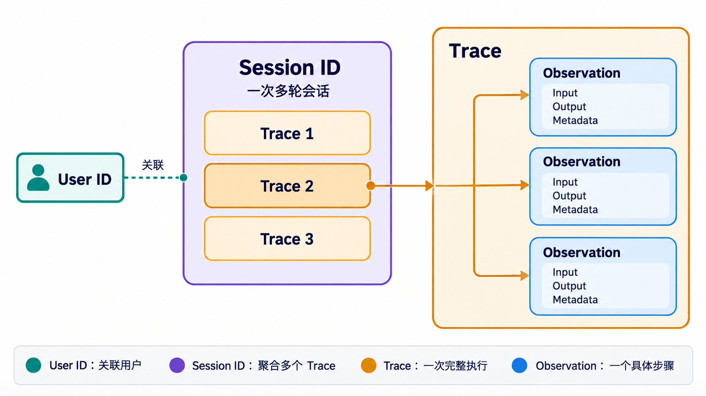

# 数据上报

我们极少直接使用 HTTP 请求访问 Langfuse，更多时候会通过 SDK 上报跟踪数据。

## 本地环境

```shell
uv add langfuse
```

学习期间建议直接使用：`uv sync`，以保持版本统一


显示禁用`.env`中的`langsmith`追踪

```shell
LANGSMITH_TRACING=false
```


## 核心概念



