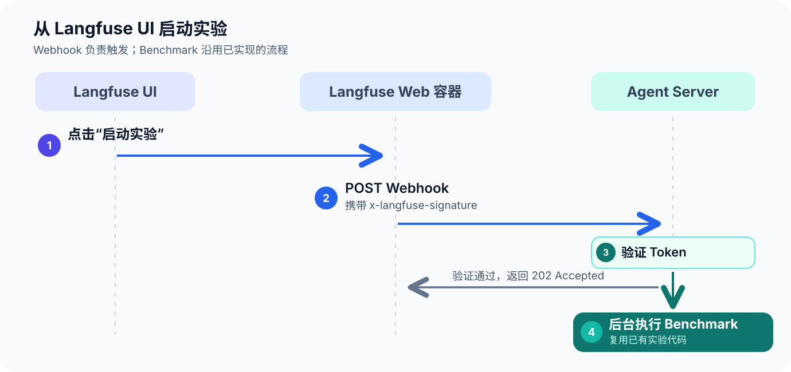

# 线上实验入口：从 Langfuse UI 启动 Agent 实验


## 完整链路



Webhook **只负责触发**。Langfuse 不会替我们运行这个 Python Agent，也不会因为回调返回 `202` 就自动产生实验结果。

## 打通 Langfuse 到 Agent Server 的访问链路

Langfuse 对 Webhook 有以下要求：

- Webhook的地址端口号必须是`80`或`443`
- Webhook的域名必须在白名单中

现在需要解决白名单的问题。

在本地开发场景中，Langfuse 在容器内部，而我们的 Agent Server 在宿主机。容器内部要访问宿主机，除了 IP 之外，还可以使用一个特殊域名：`host.docker.internal`。

因此现在必须把该域名加入到白名单。


1. 在 **Langfuse 工程**（不是本工程）的 `.env` 中加入：
   ```
   LANGFUSE_WEBHOOK_WHITELISTED_HOST=host.docker.internal
   ```

2. 覆盖`docker-compose.yml`文件

3. 重启服务器

   ```
   docker compose up -d --no-deps --force-recreate langfuse-web langfuse-worker
   ```

4. 验证环境变量是否注入
   ```
   docker compose exec langfuse-web printenv LANGFUSE_WEBHOOK_WHITELISTED_HOST
   docker compose exec langfuse-worker printenv LANGFUSE_WEBHOOK_WHITELISTED_HOST
   ```

## 配置 langfuse 实验回调

1. 点击`Run experiment`，选择`via Webhook`，选择一个数据集，点击`Configure`
2. 配置回调
   1. URL地址填写：`http://host.docker.internal/api/webhooks/langfuse/experiments`
   2. 启用`Sign requests`
   3. 将生成的`secret`保存到`Agent Server`工程的环境变量中

## 为 Agent Server 添加自定义地址

1. 配置`langgraph.json`，加入：

   ```json
     "http": {
       "app": "ai_eval.app.main:app",
       "enable_custom_route_auth": false
     }
   ```

2. 安装`fastapi`

   ```shell
   uv add fastapi
   # 此工程使用
   uv sync
   ```

3. 完成模块`ai_eval.app.main`


