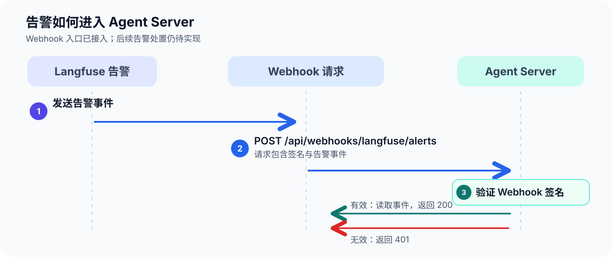

# 告警

回调地址：http://host.docker.internal/api/webhooks/langfuse/alerts

## 告警 Webhook 流程

## 常见告警及配置示例

- 模型调用费用突然升高

  - View: Observations
  - Measure: Total Cost
  - Aggregation: Sum
  - Filters:
    - Environment any of default
    - Type any of GENERATION

- 用户等待时间变长

  - View: Observations
  - Measure: Latency
  - Aggregation: P95
  - Filters:
    - Environment any of production
    - Name any of 入口 Observation 名称

- 工具调用/Agent 步骤错误变多

  - View: Observations
  - Measure: Count
  - Aggregation: Count
  - Filters:
    - Environment any of production
    - Level any of ERROR
    - Type any of TOOL

- 入口请求量异常下降

  - View: Observations
  - Measure: Count
  - Aggregation: Count
  - Filters:
    - Environment any of production
    - Name any of 入口 Observation 名称

- 回复质量下降

  - View: Scores (numeric)
  - Measure: Value
  - Aggregation: Average
  - Filters:
    - Name any of answer_quality
    - Environment any of production

- 合规检查不通过占比升高

  - View: Scores (boolean)
  - Measure: Value
  - Aggregation: Average
  - Filters:
    - Name any of policy_pass
    - Environment any of production

- 特定负面分类积累

  - View: Scores (categorical)
  - Measure: Count
  - Aggregation: Count
  - Filters:
    - Name any of 分类 Score 名称
    - Categorical Value any of unsafe
    - Environment any of production
