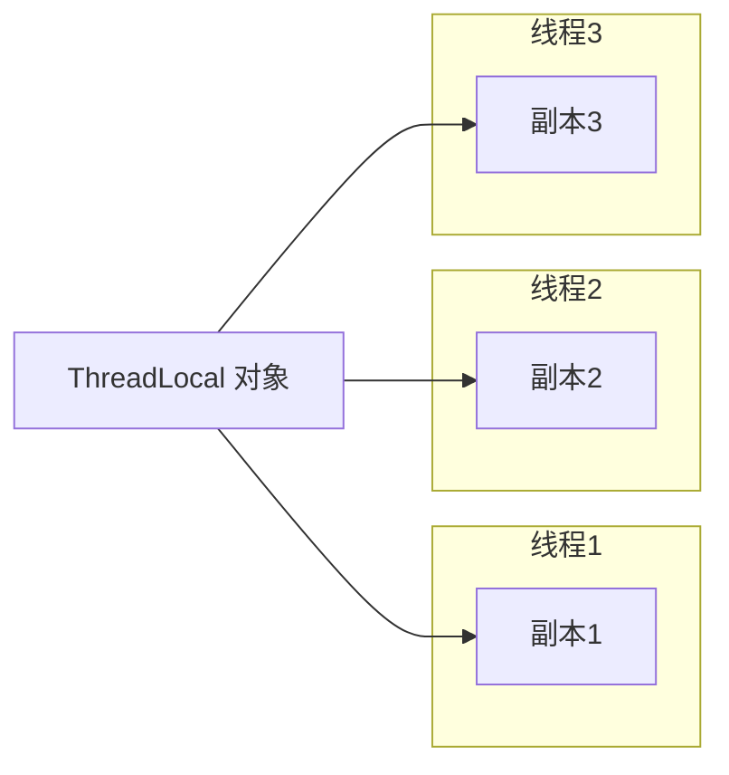
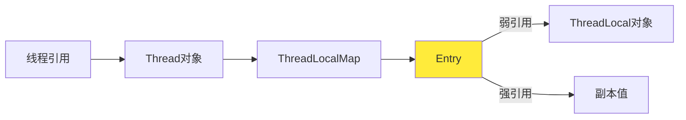
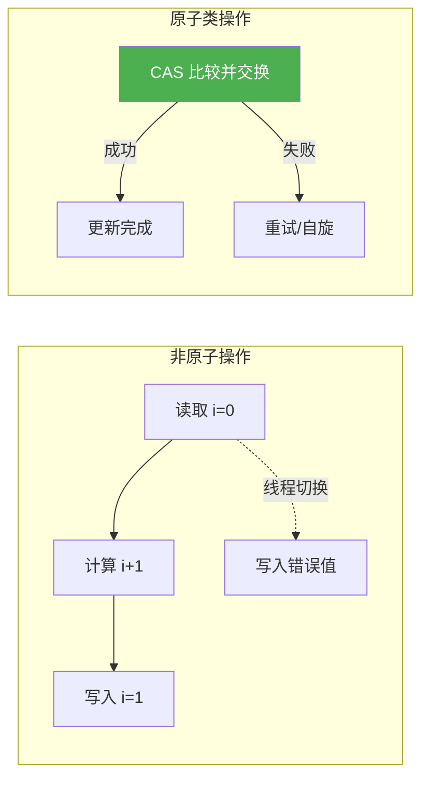

# 高并发

## `CompletableFuture` —— 异步编程的利器

### 为什么需要 `CompletableFuture`

回顾：`Future` 代表异步计算的结果，提供以下方法：

| 方法                                            | 说明                   |
| ----------------------------------------------- | ---------------------- |
| `boolean cancel(boolean mayInterruptIfRunning)` | 取消任务               |
| `boolean isCancelled()`                         | 是否已取消             |
| `boolean isDone()`                              | 是否已完成             |
| `V get()`                                       | 获取结果（阻塞等待）   |
| `V get(long timeout, TimeUnit unit)`            | 限时获取（超时抛异常） |

传统 `Future` 的局限性：

- 只能通过阻塞（`get()`）或轮询（`isDone()`）获取结果
- 无法链式组合多个异步任务
- 无法处理异常链
- 无法手动完成（设定结果）

`CompletableFuture` 弥补了这些缺陷，提供了函数式异步编程能力。

### 链式组合

| 方法                   | 说明                       |
| ---------------------- | -------------------------- |
| `thenApply(Function)`  | 对结果进行转换（有返回值） |
| `thenAccept(Consumer)` | 消费结果（无返回值）       |
| `thenRun(Runnable)`    | 执行动作（不依赖结果）     |

### 组合多个 `CompletableFuture`
| 方法                                         | 说明                                     |
| -------------------------------------------- | ---------------------------------------- |
| `thenCombine(CompletableFuture, BiFunction)` | 等待两个任务完成，合并结果               |
| `thenCompose(Function)`                      | 扁平映射（一个任务依赖另一个任务的结果） |
| `allOf(CompletableFuture...)`                | 等待所有任务完成（无返回值）             |
| `anyOf(CompletableFuture...)`                | 等待任意一个任务完成                     |

### 异常处理

| 方法                      | 说明                               |
| ------------------------- | ---------------------------------- |
| `exceptionally(Function)` | 发生异常时提供备用值               |
| `handle(BiFunction)`      | 无论是否异常，都处理结果（可转换） |

### 超时与取消

```java
CompletableFuture<Integer> future = CompletableFuture.supplyAsync(() -> {
    try { Thread.sleep(5000); } catch (Exception e) {}
    return 42;
});

// 3秒超时，超时返回默认值
future.completeOnTimeout(-1, 3, TimeUnit.SECONDS);
System.out.println(future.get()); // -1

// 或抛出超时异常
future.orTimeout(3, TimeUnit.SECONDS);
```

> [!NOTE]
> `CompletableFuture` 的链式调用非常强大，但要注意避免过长的链（可读性下降）。合理使用 `thenApply`、`thenAccept` 的组合。

# `ThreadLocal` —— 线程本地变量

### 简介

`ThreadLocal` 为每个线程提供独立的变量副本，线程之间互不干扰。



### 常用方法

| 方法           | 说明                               |
| -------------- | ---------------------------------- |
| `get()`        | 获取当前线程的副本值               |
| `set(T value)` | 设置当前线程的副本值               |
| `remove()`     | 移除当前线程的副本（防止内存泄漏） |

### 使用场景

- 线程上下文（如用户会话信息）
- 数据库连接（每个线程持有自己的连接）
- 事务管理
- 线程安全的日期格式化（`SimpleDateFormat`）

### 内存泄漏问题



**问题：** 如果线程长期存活（如线程池中的线程），且 `ThreadLocal` 对象被 GC 回收，但键为 `null` 的 Entry 仍然存在，导致值无法回收，造成内存泄漏。

**解决方法：** 使用 `try-finally` 确保 `remove()` 被调用。

```java
public void doWork() {
    SimpleDateFormat sdf = dateFormat.get();
    try {
        // 使用 sdf
    } finally {
        dateFormat.remove(); // 必须显式移除
    }
}
```

> [!CAUTION]
> 在线程池中使用 `ThreadLocal` 务必调用 `remove()`，否则可能导致内存泄漏。

## 原子类

### 简介

在多线程环境下，对共享变量进行 `i++` 等操作并非原子性，通常需要 `synchronized` 或 `Lock` 来保证线程安全。`java.util.concurrent.atomic` 包提供了一系列原子类，利用 **CAS（Compare-And-Swap）** 机制，在无锁的情况下实现线程安全的原子操作，性能更高。



### 常用原子类

| 类名                 | 说明                         |
| -------------------- | ---------------------------- |
| `AtomicInteger`      | 原子更新 `int` 类型          |
| `AtomicLong`         | 原子更新 `long` 类型         |
| `AtomicBoolean`      | 原子更新 `boolean` 类型      |
| `AtomicReference<V>` | 原子更新对象引用             |
| `AtomicIntegerArray` | 原子更新数组中的 `int` 元素  |
| `LongAdder`          | 高并发下累加性能更优（分段） |

### 常用方法（以 `AtomicInteger` 为例）

| 方法                                            | 说明                                   |
| ----------------------------------------------- | -------------------------------------- |
| `get()`                                         | 获取当前值                             |
| `set(int newValue)`                             | 设置新值（非原子，但可见）             |
| `getAndSet(int newValue)`                       | 原子设置为新值，并返回旧值             |
| `compareAndSet(int expect, int update)`         | 如果当前值等于预期值，则原子更新为新值 |
| `getAndIncrement()` / `incrementAndGet()`       | 原子自增，返回旧值/新值                |
| `getAndAdd(int delta)` / `addAndGet(int delta)` | 原子增加指定值，返回旧值/新值          |
| `updateAndGet(IntUnaryOperator)`                | 原子更新（基于函数式接口）             |

### 使用场景

- **计数器**（如请求计数、点击量）
- **状态标志**（如开关状态，`AtomicBoolean`）
- **对象引用原子更新**（如单例、配置切换）
- **高性能累加**（`LongAdder` 替代 `AtomicLong`）
- **实现非阻塞算法**（如自旋锁、无界队列）
