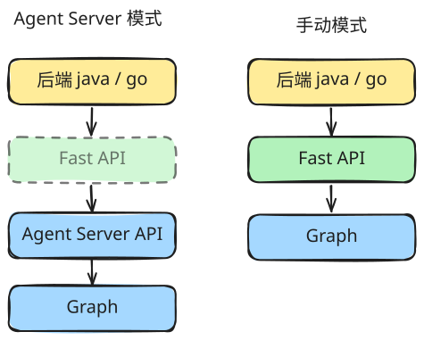

|             | Agent Server 模式                  | 手动模式                    |
| ----------- | ---------------------------------- | --------------------------- |
| compile配置 | 除 checkpointer 外，其他需要配置   | 全部需要                    |
| invoke配置  | 不需要                             | 全部需要                    |
| invoke之后  | 不需要                             | 全部需要                    |
| 学习        | 核心概念 Agent Server API接口 | 核心概念 langgraph API |

在 Agent Server 模式中，你只需要做两件事：

1. 建立编译好的图结构

2. 看懂`Agent Server API`
