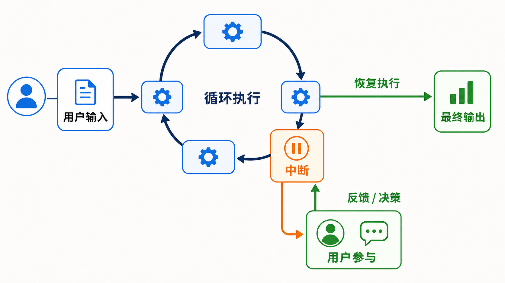

# 人在回路 HITL

> 英文全称：**Human-in-the-Loop**，简称**HITL**



## 设计 ask_question_tool 工具契约

**工具参数契约**

```json
{
  "question": "你希望使用哪种数据库？",
  "options": [
    {
      "title": "PostgreSQL",
      "description": "功能完善，适合生产环境",
      "recommended": true
    },
    {
      "title": "MySQL",
      "description": "使用广泛，生态成熟",
      "recommended": false
    },
    {
      "title": "SQLite",
      "description": "无需单独部署，适合本地开发",
      "recommended": false
    }
  ]
}
```


**中断契约**

```json
{
  "type": "ask_user_question",
  "question": "你希望使用哪种数据库？",
  "options": [
    {
      "title": "PostgreSQL",
      "description": "功能完善，适合生产环境",
      "recommended": true
    },
    {
      "title": "MySQL",
      "description": "使用广泛，生态成熟",
      "recommended": false
    },
    {
      "title": "SQLite",
      "description": "无需单独部署，适合本地开发",
      "recommended": false
    }
  ]
}
```

**回复契约**

纯字符串

```text
PostgreSQL
```
