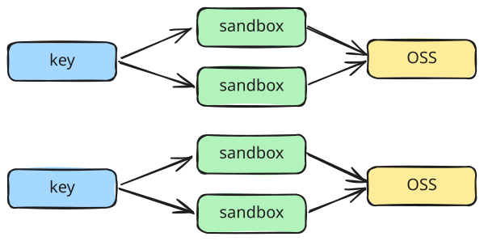

# 沙箱隔离方案




```python
from langgraph.store.base import BaseStore
from langgraph.store.memory import InMemoryStore
from e2b import AsyncSandbox


async def get_sandbox(
    *, key: str | None = None, store: BaseStore | None = None
) -> AsyncSandbox:
    "获取一个沙箱"
    pass

```

