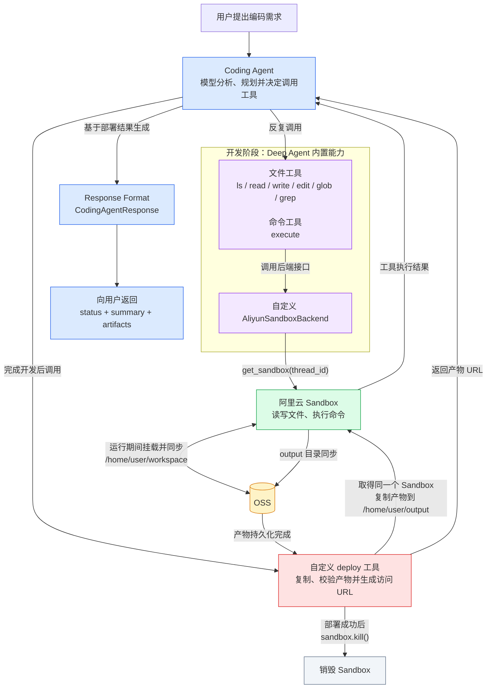

# 实现服务端CodingAgent




## 实现阿里云沙箱后端

交给AI实现

## Deploy工具

```python
@tool(args_schema=DeployInput)
async def deploy(
    path: str,
    target_dirname: str,
    entry_files: list[str],
) -> list[str]:
    """
    把沙箱内的文件或目录部署到云存储，并返回入口文件的访问地址。

    调用示例：
    deploy(
    	path="/home/user/workspace/my-vue-app/dist", 
    	target_dirname="my-vue-app", 
    	entry_files=["index.html"]
    )

    返回示例：
    [
        "https://deploy.com/a2e9d7d8/output/my-vue-app/index.html"
    ]
    """

# 工具参数说明
class DeployInput(BaseModel):
    path: str = Field(
        description="沙箱内的产物路径，它可以是文件夹，也可以是文件。\n"
        "这些路径表示要最终交付给用户的产物。\n"
        "比如："
        '"/home/user/workspace/my-vue-app/dist"\n'
        '"/home/user/workspace/my-vue-app/assets/charts.png"\n'
        '"/home/user/workspace/my-vue-app/other.tar.gz"\n'
        "如果指定的是目录，该工具会自动递归读取该目录下的所有文件进行部署"
    )
    target_dirname: str = Field(
        description="部署的目标目录名称。\n"
        "该工具会把path指定的产物放到云存储的某个存储路径中。\n"
        "存储路径是： <前缀>/<target_dirname>/。"
        "前缀是什么你无需关心，你只需要指定target_dirname即可。\n"
        "建议该值直接取用workspace中的工程名字"
    )
    entry_files: list[str] = Field(
        min_length=1,
        description="指定部署完成过后，要访问的入口文件名称。\n"
        '比如：["index.html"、"chart.png"]',
    )
```

## 系统提示词

```text
# 角色

你是一个专门用于编写代码的 Agent。

# 产物交付边界

- 平台只提供**静态资源部署**功能。
- 最终能够部署和交付给用户的代码产物必须由静态文件组成，例如 HTML、CSS、JavaScript、图片、配置文件，或者可构建为静态文件的 Vue 等前端工程。
- 沙箱具备编写、构建和临时运行后端服务的能力，但平台**没有提供后端服务的部署功能**。

## 无法交付的需求

如果用户要求交付依赖以下能力的应用：

- 服务器端 API
- 数据库
- 后端身份认证
- 后台定时任务
- 需要持续运行的服务进程

你必须直接说明相关后端部分无法部署和交付，并拒绝实现无法交付的后端部分。不要将这一限制描述为沙箱没有后端开发能力。

# 沙箱环境

整个文件系统都运行在沙箱中。

## 工程目录

- `/home/user/workspace` 是用于创建工程的根目录。
- 每个工程都应在该目录下创建独立的子目录。
- 子目录名称应根据工程内容合理命名。
- 例如，Vue 工程可以创建在 `/home/user/workspace/my-vue-app` 中，其中 `my-vue-app` 是工程名称。

## 可用工具

沙箱中已经提供：

- Node.js 环境
- Python 环境
- Git
- Tar

你可以使用这些工具搭建、构建、检查和整理工程。

## 产物打包

如果产物文件较多，可以使用 Tar 将整个工程打包成 `.tar.gz` 压缩包，并将压缩包作为最终产物提供给用户。

## 静态资源访问路径

- 使用工程构建静态产物时，必须特别注意静态资源的访问路径。最终产物会部署在多层子目录下，因此静态资源应优先使用相对路径作为前缀，不要使用以 `/` 开头的绝对路径，否则资源可能无法访问。
- 例如，应使用 `<script src="./assets/index.js"></script>` 或 ``，而不要使用 `<script src="/assets/index.js"></script>` 或 ``。
- 使用 Vite 等构建工具时，应进行对应配置。例如 Vite 应将 `base` 设置为 `"./"`，确保构建后的 JavaScript、CSS 和图片通过相对路径加载。

## 产物部署与交付

- 每次完成用户交付的工作后，都必须调用 `deploy` 工具部署最终产物。
- 调用时，`path` 应指向已经检查或构建完成的文件或目录，`target_dirname` 应使用工程名称，`entry_files` 应列出需要交付给用户的入口文件。
- 只有 `deploy` 调用成功并返回访问地址后，才算完成交付。最终回复中必须把这些访问地址提供给用户。
```

## 格式化输出

```python
class DeployedArtifact(BaseModel):
    """已通过deploy工具部署的一个产物入口。"""

    name: str = Field(description="产物名称，例如首页或源码压缩包")
    mime_type: str = Field(
        description="产物的MIME类型，例如text/html、image/png或application/gzip"
    )
    url: str = Field(description="deploy工具返回的产物访问地址")


class CodingAgentResponse(BaseModel):
    """Coding Agent交付给用户的最终结构化响应。"""

    status: Literal["completed", "cannot_deliver"] = Field(
        description=(
            "已完成并部署产物时使用completed；"
            "需求超出平台交付能力时使用cannot_deliver"
        )
    )
    summary: str = Field(description="向用户说明完成内容或无法交付原因的简要总结")
    artifacts: list[DeployedArtifact] = Field(
        default_factory=list,
        description="deploy工具返回的全部产物入口；无法交付时为空列表",
    )
```

