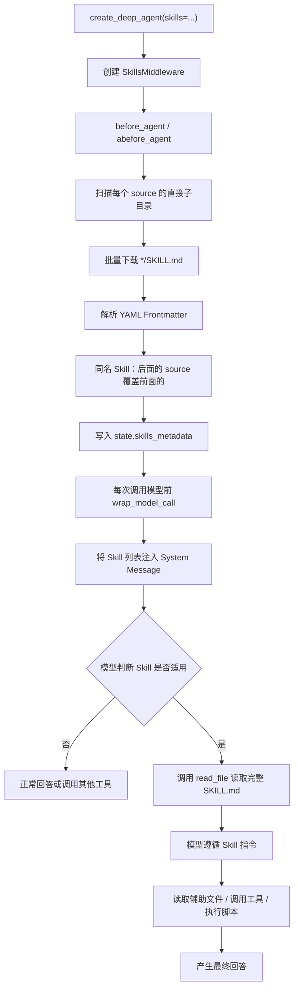

# Skills 中间件

## Skills 文件结构

https://agentskills.io/specification

```
skills
└── skill-1/
      ├── SKILL.md          # 必须: metadata + instructions
      ├── scripts/          # 可选: 可执行的代码
      ├── references/       # 可选: 包含一些额外的文档，Agent可以在需要时阅读。
      ├── assets/           # 可选: 图片、schemas、...
      └── ...               # 任意其他文件
└── skill-2/
      ├── SKILL.md          # 必须: metadata + instructions
      ├── scripts/          # 可选: 可执行的代码
      ├── references/       # 可选: 包含一些额外的文档，Agent可以在需要时阅读。
      ├── assets/           # 可选: 图片、schemas、...
      └── ...               # 任意其他文件
```

## Skills 后端选型

| 存储方案 | 功能                     |
| -------- | ------------------------ |
| 沙箱     | 拥有全部功能             |
| 其他     | 除执行之外的其他所有功能 |

## SkillsMiddleware 的执行逻辑



