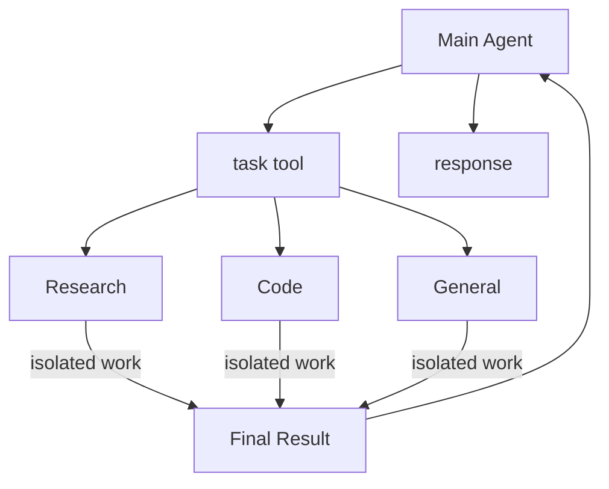

# SubAgent

```mermaid
flowchart TB
    main[Main Agent] -->subagent[task tool]
    subagent --> research[Research]
    subagent --> code[Code]
    subagent --> general[General]

    research -->|isolated work| result[Final Result]
    code -->|isolated work| result
    general -->|isolated work| result

    result --> main
		main --> response
```

`SubAgentMiddleware`会注入工具`task`用于启动子代理

